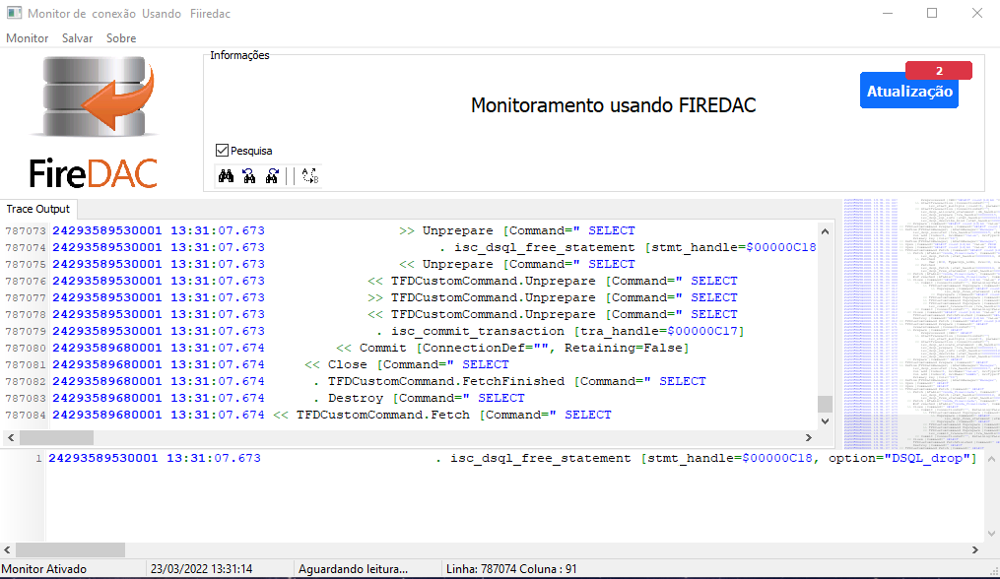

# Tracing and Monitoring (FireDAC)
## Monitore instruções SQL usando firedac.

>Requisitos
>> SynEdit https://github.com/SynEdit/SynEdit
>> Firedac Componentes

#Como usar 
Adicionar na conexão da sua aplicação o seguuinte componente
Monitor: TFDMoniRemoteClientLink; // Componente

```
    
    Monitor.Tracing := True;
    Conexao.Params.MonitorBy:= mbFlatFile;
```

Tracing and Monitoring (FireDAC)
https://docwiki.embarcadero.com/RADStudio/Alexandria/en/Tracing_and_Monitoring_(FireDAC)



